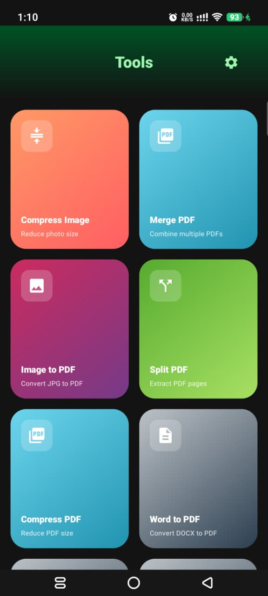

  
  <h1>🛠️ Simple Tools</h1>
  

    <b>The Ultimate, All-In-One Offline Document & Image Converter for Android</b>
  

  
  
  
  
  
   
   
  
  
  </a>

---

## 🌟 Why Simple Tools?

Converting files shouldn't require an internet connection, a subscription, or waiting in queues. **Simple Tools** does all the heavy lifting directly on your device. Zero servers, zero tracking, 100% privacy!

### ✨ Core Features

- **Compress Image:** Kurangi ukuran foto (JPG/PNG) secara offline.
- **Merge PDF:** Gabungkan beberapa file PDF menjadi satu dokumen dengan mudah.
- **Image to PDF:** Konversi gambar (JPG/PNG) menjadi satu file PDF.
- **Split PDF:** Pisahkan halaman tertentu dari file PDF menjadi dokumen terpisah.
- **Compress PDF:** Kompresi cerdas untuk memperkecil ukuran file PDF.
- **Word to PDF:** Ubah dokumen DOCX menjadi PDF dengan rapi.
- **PDF to Word:** Ekstrak teks dari PDF menjadi dokumen Word (DOCX) yang bisa diedit.
- **Scanner:** Scanner dokumen kelas premium dengan auto-edge detection dan filter B&W.
- **QR & Barcode:** Scan kode dengan aman, atau generate QR (plus logo & warna) dan Barcode offline.
- **History:** Akses mudah ke semua file hasil konversi dan proses sebelumnya.

### 🚀 Built for Productivity

- **Batch Processing**: Convert multiple files at once and reorder them easily.
- **Offline First**: Works anywhere, anytime. No internet required.
- **Smart History**: All your processed files are safely stored in your `Downloads/OfflineConverter` folder and easily accessible directly from the app's _History_ screen!

---

## 📸 Screenshots

## 📥 Installation

1. Download the latest APK by clicking the **Download APK** button above.
2. Locate the downloaded `Simple-Tools-v1.2.0.apk` file on your Android device.
3. Tap to install (make sure to allow installation from unknown sources if prompted).
4. Enjoy converting entirely offline!

## 🛠️ Technical Stack

- **UI Framework:** Jetpack Compose (Material 3)
- **Architecture:** MVVM, Coroutines, StateFlow
- **PDF Engine:** Apache PDFBox (Android Port)
- **Document Engine:** Apache POI

## 🤝 Contributing

Contributions, issues, and feature requests are welcome! Feel free to check the [issues page](https://github.com/Vall-Here/Simple-Tools/issues).
